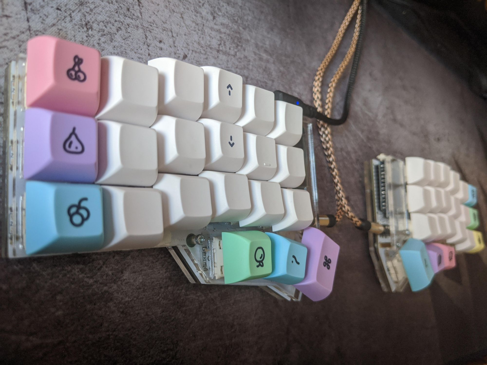

# crkbd Keymap

This repository contains my [crkbd](https://github.com/foostan/crkbd) keymap.



To try this keymap out on your board, set up QMK firmware on your system as per the [guide](https://docs.qmk.fm/#/newbs_getting_started), then, while in the `qmk_firmware` directory, run the following commands:

```bash
git submodule add https://github.com/mtoohey31/crkbd-keymap ./keyboards/crkbd/keymaps/mtoohey31
qmk compile -kb crkbd/rev1 -km mtoohey31
```

Then follow the instructions in the QMK docs to flash the keymap to your board, and be sure to select the correct MCU, if you're using an Elite-C like me it's the ATmega32u4.

You can safely ignore the `swapped-left-pins.patch` file, unless you also happen to have fried the same pins on your controller while building your board that I did :sweat_smile:, if you did somehow though (and also so that I don't forget) you can apply the patch file to QMK's crkbd `config.h` by running:

```bash
git apply keyboards/crkbd/keymaps/mtoohey31/swapped-left-pins.patch
```

...then commenting and re-commenting lines 34 and 36 based on which keyboard half you're building the firmware for.
